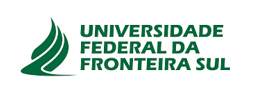

#### Curso de Ciência da Computação ####

## Chamada Automatica ##

#### Elaborado pelos acadêmicos Maikon Douglas, Tatiane Arndt Barbosa, Darlan Adriano Schmitz, Jóvio  Giacomolli, Deividi Luiz, Tiago Debastiani, Jardel Osório Duarte. ####  

 #### O presente trabalho tem o objetivo de criar uma chamada automatizada com o intuito de facilitar a auto inclusão dos alunos e facilitar/otimizar o tempo de aula dos professores. Universidade Federal da Fronteira Sul - UFFS

#### Chapecó - SC ####

Como Testar :
install: npm i -g json-server ionic/cli 

1 - Clone repositório - $ git clone https//:link
 
2 - No repositório call-list: $ json-server --watch API/data.json (obs se vscode terminal 1)

3 - Abra outro terminal(vs ou shell) tb no repositório call-list: $ ionic serve --open 

